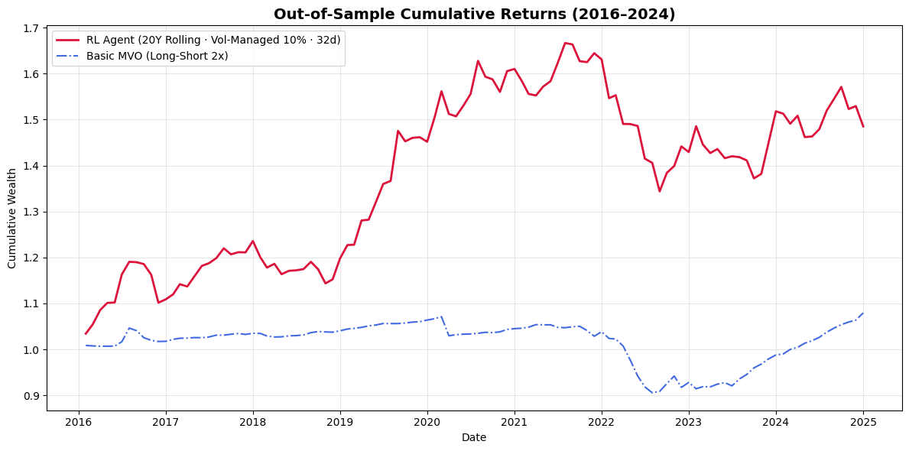
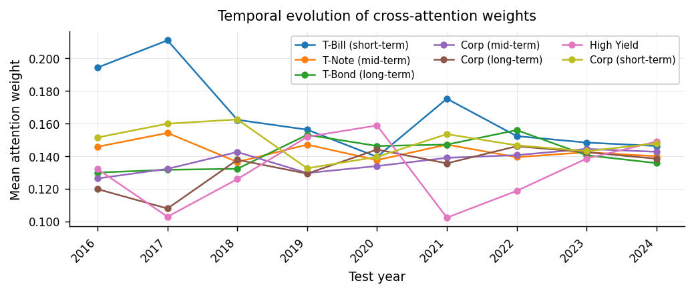
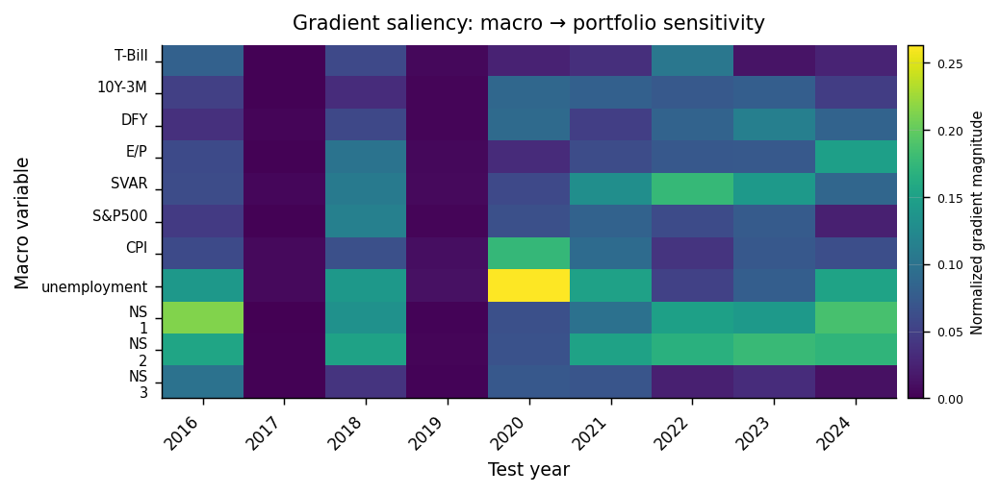

# Bond Portfolio Optimization with Attention

거시경제 상태와 채권 자산 간의 상호작용을 **Transformer Cross-Attention**으로 학습해, 7개 채권 자산의 롱·숏 비중을 매월 동적으로 조정하는 포트폴리오 모델입니다. 손실함수로 연율화 초과 샤프지수를 직접 미분해 정책(가중치 함수)을 end-to-end로 학습합니다.

> 아주대학교 금융딥러닝 기말 프로젝트 (B조) · [발표자료 PDF](docs/presentation.pdf)

<p align="center"></p>

## Results (Out-of-sample, 2016–2024)

| | RL Agent | Basic MVO |
|---|---:|---:|
| Cumulative Return | **48.52%** | 7.93% |
| Annualized Return | **4.73%** | 0.91% |
| Volatility (ann.) | 8.13% | 3.39% |
| Sharpe Ratio | **0.580** | 0.262 |
| Max Drawdown | −19.38% | −15.45% |

### Robustness

| Setting | Agent Sharpe | MVO Sharpe | Agent Cum. Return | 비고 |
|---|---:|---:|---:|---|
| Baseline (long-short) | 0.580 | 0.262 | 48.52% | |
| Long-only (softmax × 2) | 0.405 | 0.193 | 35.88% | MDD −30.79% |
| Transaction cost 10bp | 0.488 | −0.047 | 40.09% | 월평균 turnover 61.0% (MVO 88.3%) |

Turnover 정의는 Gu, Kelly & Xiu (2020)를 따랐고, 거래비용(turnover × 10bp)을 차감한 순수익률로 샤프지수를 학습합니다.

## Data

**자산 (7개, Yahoo Finance)** — ETF 상장 이전 기간까지 확보하기 위해 Vanguard 채권형 뮤추얼펀드를 대체지표로 사용

| Variable | Fund | Asset class |
|---|---|---|
| `TR_TREAS_S` | VFISX | 단기 국채 |
| `TR_TREAS_M` | VFITX | 중기 국채 |
| `TR_TREAS_L` | VUSTX | 장기 국채 |
| `TR_CORP_S` | VFSTX | 단기 투자등급 회사채 |
| `TR_CORP_M` | VFICX | 중기 투자등급 회사채 |
| `TR_CORP_L` | VWESX | 장기 투자등급 회사채 |
| `TR_HY` | VWEHX | 하이일드 회사채 |

**거시 변수 (11개)**

- Goyal–Welch (2008) 데이터셋: T-bill, 기간 스프레드(10Y−3M), 신용 스프레드(BAA−AAA), E/P, SVAR, S&P 500 수익률
- FRED: CPI YoY, 실업률 (발표 시차를 고려해 1개월 lag)
- FRED 국채 금리(3M–30Y)에 Nelson–Siegel OLS를 적합해 얻은 β₁(level), β₂(slope), β₃(curvature)

최종 샘플은 1993-11 ~ 2024-12 (월별)입니다. Yahoo Finance와 FRED 데이터는 실행 시 자동으로 다운로드되며, Goyal–Welch 데이터는 [`data/PredictorData2024_monthly.csv`](data/)에 포함되어 있습니다 (출처: [Amit Goyal 웹사이트](https://sites.google.com/view/agoyal145)).

## Model

<p align="center"> </p>

- **Asset encoder**: 자산별 12개월 수익률 시퀀스 → Linear(1→32) → Transformer Encoder (1 layer, 2 heads) → 마지막 시점 임베딩
- **Macro encoder**: 12개월 거시 시퀀스 → Linear(11→32) → Transformer Encoder → 마지막 시점을 query로 사용
- **Cross-Attention**: macro query가 asset key/value를 참조 → residual + LayerNorm
- **Head**: `[context, w_prev]` → MLP(33→16→1) → `2·tanh` → gross exposure ≤ 2 로 rescale
- **Volatility management** (Moreira & Muir, 2017): 직전 12개월 실현변동성이 목표(연 10%)를 넘으면 비중 축소 (`scale = clamp(0.10/σ, 0.1, 1.0)`, 저변동 구간에서 레버리지 확대 없음)
- **Loss**: `−√12 · E[Rᵖ − Rᶠ] / Std(Rᵖ − Rᶠ)` (연율화 초과 샤프지수)

**학습 스킴**: 테스트 연도(2016–2024)마다 Train 240개월 / Validation 24개월 / Test 12개월의 rolling window를 1년씩 이동하며, 이전 연도 모델을 이어서 학습합니다(continual learning). 정규화 통계는 매 윈도우의 train 구간에서만 계산하고 테스트 연도 데이터는 학습·검증에 쓰지 않습니다. LR 1e-5, warm-up 30 epoch + cosine decay, early stopping (patience 10).

## Repository Structure

```
├── notebooks/
│   ├── 01_model_experiment.ipynb   # 데이터 수집·학습·MVO 비교·비중/어텐션/saliency 분석
│   └── 02_robustness.ipynb         # Long-only 제약, 10bp 거래비용
├── data/
│   └── PredictorData2024_monthly.csv
├── assets/                         # README 그림
├── docs/presentation.pdf
└── requirements.txt
```

## How to Run

Google Colab (GPU T4)에서 작성되었습니다. 노트북을 Colab에서 열면 Goyal–Welch CSV는 repo에서 자동으로 읽어옵니다.

[](https://colab.research.google.com/github/parkjunhee-kk/Bond-Portfolio-optimization-with-Attention/blob/main/notebooks/01_model_experiment.ipynb)

로컬 실행:

```bash
git clone https://github.com/parkjunhee-kk/Bond-Portfolio-optimization-with-Attention.git
cd Bond-Portfolio-optimization-with-Attention
pip install -r requirements.txt
jupyter notebook notebooks/
```

Yahoo Finance의 수정주가는 배당·분할 반영 방식이 사후적으로 갱신될 수 있어, 재실행 시 수치가 노트북에 저장된 결과와 소폭 다를 수 있습니다.

## Limitations

- 단일 시드(42) 결과이며, 시드별 분산은 측정하지 않았습니다.
- 뮤추얼펀드 수익률은 실제 숏 포지션 구현 가능성(차입비용 등)을 반영하지 않습니다.
- 거래비용은 10bp 단일 가정입니다.

## Team

B조 — 박현서 (금융공학과), 김규리 · 박준희 · 박해인 (수학과)

## References

- Welch, I., & Goyal, A. (2008). A comprehensive look at the empirical performance of equity premium prediction. *Review of Financial Studies*.
- Ludvigson, S. C., & Ng, S. (2006). Macro factors in bond risk premia. NBER Working Paper No. 11703.
- Joslin, S., Priebsch, M., & Singleton, K. J. (2014). Risk premiums in dynamic term structure models with unspanned macro risks. *Journal of Finance*.
- Campbell, J. Y., & Taksler, G. B. (2003). Equity volatility and corporate bond yields. *Journal of Finance*.
- Gilchrist, S., & Zakrajšek, E. (2012). Credit spreads and business cycle fluctuations. *American Economic Review*.
- Gu, S., Kelly, B., & Xiu, D. (2020). Empirical asset pricing via machine learning. *Review of Financial Studies*.
- Moreira, A., & Muir, T. (2017). Volatility-managed portfolios. *Journal of Finance*.
- Sood, S., Papasotiriou, K., Vaiciulis, M., & Balch, T. (2026). Deep reinforcement learning for optimal portfolio allocation: A comparative study with mean-variance optimization. arXiv.
- Vaswani, A., et al. (2017). Attention is all you need. *NeurIPS*.

## License

[MIT](LICENSE)
